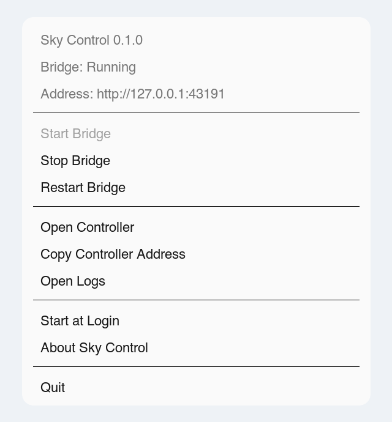
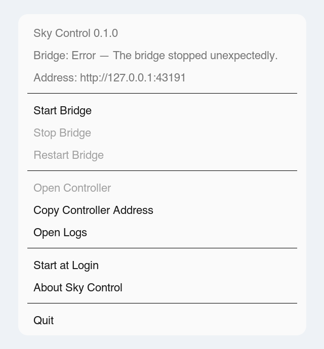

# Sky Control

Sky Control is an unofficial, local-first bridge and mobile-friendly controller
for air conditioners that speak the Skyworth SWM100 local-network protocol. It
exists because the legacy controller app is abandoned or unavailable for many
owners while the appliance itself still works.

The project is not affiliated with or endorsed by Skyworth, Tekno Point,
Clima24, Easy Home, or any other manufacturer. Manufacturer and app names are
used only to describe tested or possible compatibility.

> Public beta safety: Sky Control is designed for a trusted LAN or private VPN.
> Never port-forward it or expose it directly to the public internet.

## Screenshots

The same local controller adapts from a desktop dashboard to a phone-sized layout.

<p align="center">
  
  
</p>

The macOS beta keeps bridge status and common lifecycle actions in the menu bar.

<p align="center">
  
  
</p>

### Abandoned legacy app

If your former controller looked like this, the unit may belong to the same app
or protocol family. Interface similarity is a useful lead, not confirmation of
hardware compatibility.

<p align="center">
  
</p>

## What this beta provides

- UDP discovery for SWM100-family modules.
- TCP status reading and verified local controls.
- Multiple named air conditioners.
- A responsive web controller for desktop and phone.
- Optional bearer-token authentication.
- Sanitized diagnostics for compatibility reports.
- A per-user macOS LaunchAgent installer.
- An unsigned macOS menu-bar application for private beta testing.
- Portable protocol fixtures and hardware-free tests.

This foundation does not include the planned Windows tray application, direct
Home Assistant integration, native mobile apps, cloud relay, Matter support, or
Wi-Fi provisioning. See [ROADMAP.md](ROADMAP.md).

## Compatibility

Compatibility refers to physical hardware, not visual similarity between
branded apps. A shared app design is a useful lead, never confirmation.

### Confirmed hardware

| Manufacturer | Physical unit | Legacy app / Wi-Fi protocol | Verification |
| --- | --- | --- | --- |
| Tekno Point | SKY (one tested unit) | Clima24 / Skyworth SWM100 | Discovery, status and control verified against captured Clima24 traffic and live hardware |

### Likely compatible and seeking testers

| Candidate | Evidence | Status |
| --- | --- | --- |
| Units previously controlled by Tekno Point Smart Controller | Appears related to the tested app family | Models other than the tested SKY unit are unconfirmed |
| Other units previously controlled by Clima24 | The confirmed Tekno Point SKY unit used Clima24 | Models other than the tested SKY unit are unconfirmed |
| Units previously controlled by Easy Home AMS | Appears to be a branded variant of the same app family | Physical compatibility unconfirmed |
| Other units reporting SWM100-family protocol values | Protocol-family signal only | Seeking sanitized diagnostics and hardware tests |

### Reported incompatible

No physical units have been responsibly confirmed incompatible yet.

Please use the compatibility issue template for results. Do not upload vendor
apps, proprietary binaries, tokens, IP addresses, MAC addresses, or raw private
captures.

## Architecture

The repository intentionally remains one small Next.js application:

```text
app/                    Web controller and local HTTP route handlers
desktop/                Native menu shell and shared lifecycle supervision
lib/airco/protocol.ts   Pure packet codec and CRC handling
lib/airco/client.ts     TCP sessions and device communication
lib/airco/discovery.ts  UDP discovery
lib/bridge/             Validated bridge configuration
lib/diagnostics.ts      Sanitized issue-report data
fixtures/protocol/      Portable, identifier-free captured behavior
support/                macOS service and protocol-research tools
tests/                  Hardware-free automated tests
```

The protocol codec never opens a socket. Automated tests cannot discover or
control a physical air conditioner. The architecture decisions are recorded in
[ADR 0001](docs/adr/0001-local-first-shared-protocol.md) and
[ADR 0002](docs/adr/0002-electron-menu-bar-bridge.md).

## Requirements

- The packaged menu-bar beta requires macOS. Its Electron runtime includes Node.js.
- Source and headless installations require Node.js 22.13 or newer (Node 22 and 24 are validated in CI) and npm.
- The bridge machine must be on the same local network as the unit.
- For discovery, permission to use UDP broadcast/multicast on the LAN.

## Install and run

```bash
# From the Sky Control source checkout:
npm ci
cp .env.example .env.local
npm test
npm run dev
```

Open `http://127.0.0.1:3000` on the bridge machine. On another LAN device, use
the bridge machine's local hostname or LAN address, for example
`http://bridge-mac.local:3000`.

A fresh install starts with no units. Select **Add airco**, scan the local
network, or enter a hostname and port manually. Once configured, status and
controls are available immediately.

### Phone access and Add to Home Screen

Connect the phone to the same trusted Wi-Fi network and open the bridge's local
URL. On iPhone or iPad, use Safari's Share menu and select **Add to Home Screen**.
On Android, use the browser menu's **Add to Home screen** or **Install app**
action. The bridge must remain running for the shortcut to work.

## Configuration

Copy `.env.example` to `.env.local`. Every local environment file and runtime
state file is ignored by Git. For the menu-bar app, the optional file lives at
`~/Library/Application Support/Sky Control/.env.local`. An environment variable
provided by the launching process takes precedence over the same key in that
file; this is useful for managed deployments but can make a file value appear to
be ignored.

| Variable | Default | Purpose |
| --- | --- | --- |
| `SKY_CONTROL_HOST` | `0.0.0.0` | Bridge listener; use `127.0.0.1` to restrict access to this machine |
| `SKY_CONTROL_PORT` | `3000` | Bridge HTTP port |
| `AIRCO_TOKEN` | unset | Pins a bearer token and prevents changing it in the UI; minimum 16 characters |
| `AIRCO_HOST` | unset | Optional first-device hostname or IP seed |
| `AIRCO_PORT` | `1998` | First-device and discovery control port |
| `AIRCO_CONFIG_PATH` | `data/aircos.json` | Device configuration file |
| `AIRCO_SETTINGS_PATH` | `data/settings.json` | UI-managed access-token file |
| `SKY_CONTROL_ALLOWED_DEV_ORIGINS` | unset | Comma-separated development origins; not used in production |

Generate a strong token rather than inventing one:

```bash
openssl rand -hex 32
```

Paste it into `AIRCO_TOKEN` or use **Settings → Require an access token →
Generate**. The UI stores its copy in that browser's local storage. Normal logs
and diagnostic reports never include it.

## Security model

Sky Control has no cloud service and does not need an internet connection after
installation. It trusts the network boundary: without a token, anyone who can
reach the bridge can read status and send commands. Use a token on shared Wi-Fi
and over any VPN.

Do not expose the bridge with router port forwarding, public reverse proxies,
tunnels that create public URLs, or a public firewall rule. TLS termination,
rate limiting, and internet-facing hardening are outside this milestone.

### Advanced remote access with WireGuard

Run WireGuard on a router or another always-on host, connect the remote phone to
that private VPN, and visit the bridge's VPN-reachable private address. Restrict
the VPN peer to the LAN ranges and ports it needs, keep `AIRCO_TOKEN` enabled,
and keep the bridge's HTTP port closed on the public WAN interface. WireGuard is
not bundled or configured by this project.

See [SECURITY.md](SECURITY.md) for reporting and operational guidance.

## Safe diagnostics

The **Activity → Download safe diagnostics** action creates JSON intended for a
public issue. It contains exactly:

- Sky Control and Node.js versions.
- The SWM100 protocol-family label.
- Whether authentication is enabled, plus the bridge port.
- Reported model and protocol values from discovery.
- The last operation attempted and a normalized error code.
- Counts of received bytes and valid frames, and whether a state frame arrived.
- Explicit `redacted` markers for network address, MAC address, and reported
  device name.

It does not contain access tokens, device IDs, user-assigned names or locations,
IP addresses, MAC addresses, local paths, logs, state values, or full packet
contents. Review any file before posting it publicly.

## macOS installation modes

Sky Control has three distinct installation modes. Run only one production
bridge on a given address and port.

### Menu-bar application (recommended private beta)

Build the unsigned local artifacts on a Mac with Node.js 22.13 or newer:

```bash
npm ci
npm ci --prefix desktop/tooling
npm run desktop:package
```

The command creates `dist/mac-*/Sky Control.app`, a DMG, and a ZIP for the
current Mac architecture, then validates that the app contains its bridge,
static assets, menu-bar configuration, and licences. Open the DMG, drag **Sky
Control** to Applications, and open it. The beta is not signed or notarized, so
macOS may require a control-click → **Open** confirmation or approval in
**System Settings → Privacy & Security**. Do not disable Gatekeeper globally.

The app has no permanent Dock icon or main window. It starts its bundled bridge
when opened and remains in the menu bar when the controller browser tab closes.
Its menu provides bridge status, start, stop, restart, controller, copy-address,
logs, Start at Login, About, and Quit actions. Each configured airco also gets a
submenu with room and target readings, an explicit device-status refresh, a
power toggle, mode choices, and target temperatures from 16–30°C. Opening the
menu and its periodic menu refresh only read the local bridge cache; only
**Refresh Device Status** contacts the airco, and controls are sent only after a
deliberate menu selection. Start at Login is off by default and uses the macOS
login-item setting; migration from an existing headless service offers to enable
it explicitly.

The packaged app does not require this source checkout or a separate Node.js
installation. Runtime files are read from the app bundle. Writable files are:

| Purpose | Location |
| --- | --- |
| Device configuration | `~/Library/Application Support/Sky Control/data/aircos.json` |
| Access settings | `~/Library/Application Support/Sky Control/data/settings.json` |
| Optional bridge environment | `~/Library/Application Support/Sky Control/.env.local` |
| Menu-bar bridge log | `~/Library/Logs/Sky Control/bridge.log` |

To uninstall, turn off **Start at Login**, choose **Quit**, and move Sky Control
from Applications to the Trash. Configuration is deliberately retained. If the
app cannot open, disable it in **System Settings → General → Login Items**. Remove
the Application Support and Logs folders manually only after confirming their
configuration is no longer needed.

### Headless LaunchAgent (advanced)

The installer builds a standalone runtime and creates a per-user LaunchAgent.
It does not require administrator access.

```bash
npm run service:install
npm run service:status
npm run service:restart
npm run service:uninstall
```

The runtime lives in `~/Library/Application Support/Sky Control`, and logs live
in `~/Library/Logs`. The installer preserves existing state and migrates state
from the earlier `Sky Local` path when present. `service:deploy` remains an alias
for `service:install`.

Uninstall removes the LaunchAgent but deliberately keeps runtime configuration
for recovery. After confirming it is no longer needed, remove the printed
runtime directory manually. Re-running `service:install` updates the copied
runtime without modifying the source configuration first.

The menu-bar app detects both the current and legacy LaunchAgent. It will not
start another bridge when an installed or running agent is configured for the
same port. Choose **Switch from Headless Service…** only when ready to migrate;
after confirmation the app unloads the agent, retains its plist with a
`.menu-bar-disabled` backup name (adding a numeric suffix rather than overwriting
an earlier backup), keeps the shared data directory, enables Start at Login, and
starts the managed bridge. To return to headless operation, first
turn off Start at Login and quit the app, then run `npm run service:install`
from a source checkout. Never run both modes on the same port.

### Source/development mode

Use `npm run dev` for web development and `npm run desktop:dev` for the native
shell against a freshly built standalone runtime. Development mode requires the
repository and Node.js and is not an installation method.

## Troubleshooting

### Discovery finds nothing

- Confirm the bridge and air conditioner are on the same non-guest LAN.
- Check that client isolation is disabled for that Wi-Fi network.
- Allow UDP broadcast/multicast ports 1990–1995 in the local firewall.
- Add the unit manually using its DHCP reservation or `.local` hostname.

### The unit is offline or status never arrives

- Confirm the legacy app is closed while testing.
- Check that TCP port 1998 is reachable inside the LAN.
- Verify the device address has not changed; prefer a DHCP reservation.
- Download safe diagnostics and open a compatibility issue.

### Authentication fails

- Use the same token configured on the bridge; tokens are case-sensitive.
- When `AIRCO_TOKEN` is set, the UI cannot replace or clear it.
- Clear the browser's stored token and reconnect after changing the server token.

### The menu says the headless service conflicts

Another Sky Control LaunchAgent is installed or running on the configured port.
Keep the headless service, or use the explicit migration action in the menu.
Sky Control never stops or uninstalls it merely because the app was opened.

### The menu says the port is already in use

Another process owns the configured HTTP port. Stop that process or choose a
different `SKY_CONTROL_PORT` in the Application Support `.env.local`, then try
**Start Bridge** again. Details remain in the private per-user bridge log.

### Unsigned beta will not open

Confirm the artifact came from the expected local build, then use macOS's
control-click → **Open** flow or Privacy & Security settings. A future release
should use a Developer ID certificate, hardened runtime, notarization, and
stapling; none of those are claimed for this beta.

## Development and validation

```bash
npm test       # hardware-free protocol/configuration regression tests
npm run lint   # ESLint
npm run build  # production build and TypeScript validation
npm run desktop:check     # CI-safe desktop source/bundle validation
npm run desktop:package   # macOS app + unsigned DMG/ZIP + validation
npm run desktop:validate  # validate an already packaged app
```

Next.js 16 uses Turbopack by default; this project opts into its documented
Webpack build path because it is reliable in restricted local and CI
environments. Development still uses the current Next.js dev server.

Contributions are welcome; read [CONTRIBUTING.md](CONTRIBUTING.md) before adding
captures or protocol behavior. Sky Control is available under the [MIT License](LICENSE).
