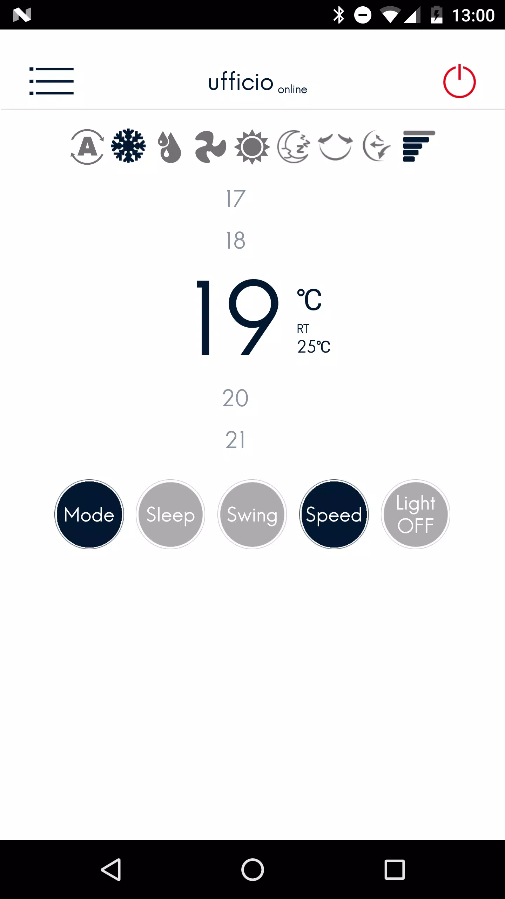
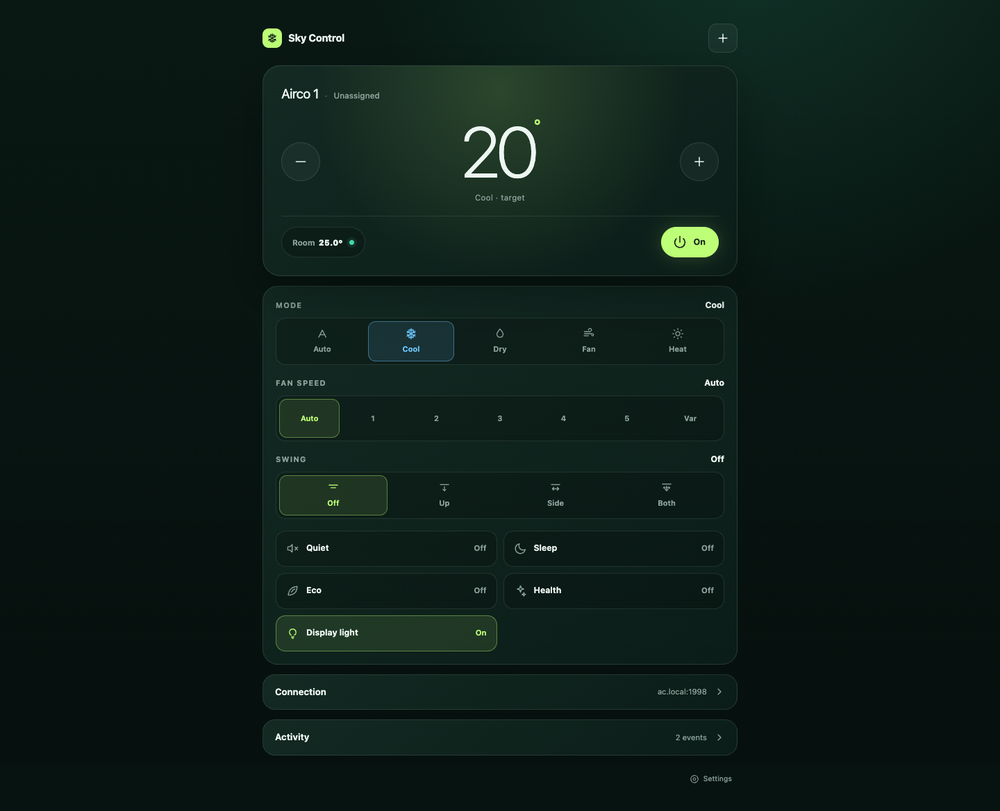
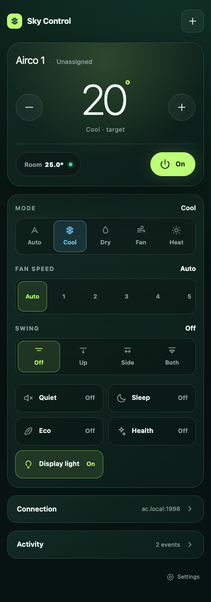
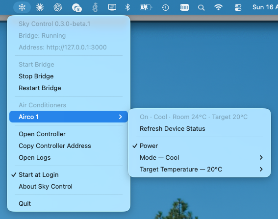
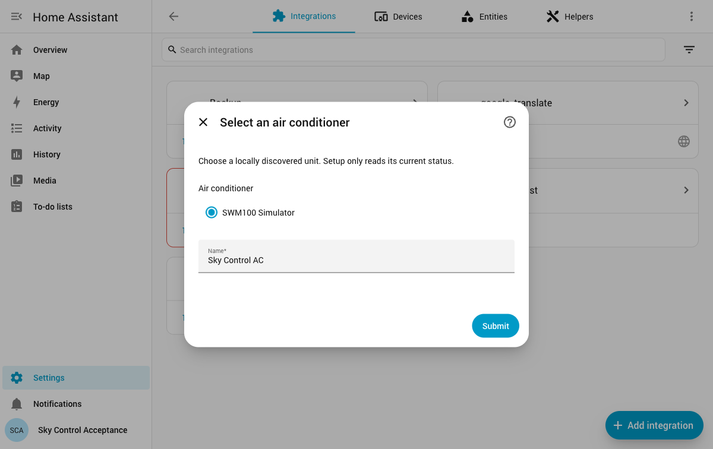
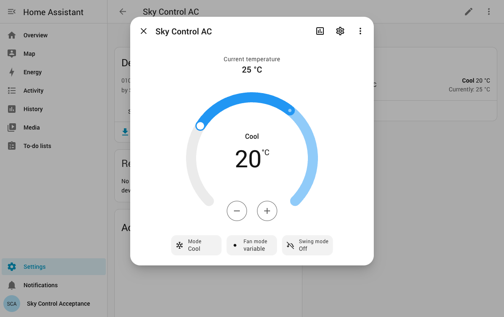

# Sky Control - Skyworth SWM100 Wi-Fi module community app

Control your air conditioner from your phone or computer, even if the
manufacturer's app has stopped working. Sky Control is a free, independent
project that runs entirely on your own home network, with no account, cloud
service, or subscription required. Targeted for units with a Skyworth SWM100 Wi-Fi module.

If your former controller app looked like this, your unit may belong to the
same family, but that's a lead worth testing, not a guarantee:

<p align="center">
  
</p>

Names of some the discontinued SWM100 apps: Skyworth Smart Control, Clima24H, Easy Home AMS, Teknopoint Smart Controller, Joannes Air Conditioner, Ferroli Air Conditioner, Lamborghini Air Conditioner, Cvmore Air Conditioner

## What is Sky Control?

Many air conditioners are controlled by a Wi-Fi module and a companion phone
app. When that app is discontinued, removed from the app store, or simply
stops working, the air conditioner's smart features stop working with it —
even though the hardware is fine.

Sky Control replaces that app with a small program (called the bridge)
that runs on a Mac and hosts a simple web page. You can open that page on any
phone, tablet, or computer on your home network or remotely via vpn access. It talks to the air
conditioner directly from the bridge, so nothing has to go through a manufacturer's app server.

The same page adapts from a full desktop dashboard to a phone-sized layout:

<p align="center">
  
  
</p>

On a Mac, an optional menu-bar app keeps things running quietly in the background and gives you some ac control:

<p align="center">
  
</p>

If you already run Home Assistant, a beta integration skips the bridge and the
Mac entirely: Home Assistant finds the unit on your network and controls it as
a native climate device.

<p align="center">
  
  
</p>

## What can it do?

- Automatically find your air conditioner on your home Wi-Fi network.
- Turn it on or off, change modes, and set the temperature, with live status.
- Control more than one air conditioner, each with its own name.
- Work from a phone, tablet, or computer browser — no app store needed.
- Appear as a native climate device in Home Assistant, without the web bridge.
- Optionally protect access with a password (an access token).
- Generate a safe, shareable diagnostics report if something isn't working.

> [!IMPORTANT]
> **We can currently only find an air conditioner if you had the Wi-Fi set up
> on the unit before.** Wi-Fi setup will be attempted in future releases.

Sky Control is still early (a public beta). It doesn't yet include a Windows
version, native mobile apps, or automatic Wi-Fi setup for new devices. See
[ROADMAP.md](ROADMAP.md) for what's planned.

## Installing Sky Control

Sky Control currently runs three ways:

| Option | Runs on | Best if |
| --- | --- | --- |
| **Menu-bar app** | Your Mac | You want the simplest day-to-day experience, with status and controls right in the menu bar |
| **Headless service** | Your Mac | You want it running quietly in the background all the time, e.g. on a Mac mini |
| **Home Assistant integration** (beta) | Wherever Home Assistant runs — no Mac required | You already use Home Assistant and want a native climate entity |

There's no Windows version yet — the menu-bar app and headless service are the
two ways to run the bridge, and both need a Mac. The Home Assistant
integration is the one option that doesn't need a Mac at all: it skips the
bridge and talks to the air conditioner directly from wherever Home Assistant
already runs (Home Assistant OS, a Raspberry Pi, a NAS, and so on).

### Ask an AI assistant to install it for you

For any of the three options, the easiest path these days is to copy this link and give
it to an AI assistant, such as Claude Cowork/Code, ChatGPT/Codex, Grok Build, or GitHub Copilot:

```
https://github.com/kevin-eveleigh/sky-control
```

Paste it in and ask something like *"Please install and set this up for me."*
Tell it which option you want, or describe your setup — a Mac you use every
day, a Mac you leave running, or an existing Home Assistant instance — and
let it choose. The project includes machine-readable setup instructions that
let an assistant follow any of the three options below on its own.

The rest of this section is the full manual instructions for each option.

### Option 1: macOS menu-bar app

Best for most Mac users: a small app in the menu bar that starts the bridge
for you and gives you status and controls without opening a browser.

**Requirements:** macOS. Node.js 22.13 or newer only if you're building it
yourself from source (an AI assistant, or a downloaded prebuilt release,
doesn't need this on your end — the packaged app bundles its own Node.js
runtime). The Mac must be on the same local network as the air conditioner,
with permission to use UDP broadcast/multicast for discovery.

Build the unsigned local artifacts on a Mac with Node.js 22.13 or newer:

```bash
npm ci
npm ci --prefix desktop/tooling
npm run desktop:package
```

The command creates `dist/mac-*/Sky Control.app`, a DMG, and a ZIP for the
current Mac architecture, then validates that the app contains its bridge,
static assets, menu-bar configuration, and licences. Open the DMG, drag **Sky
Control** to Applications, and open it. The beta is not signed or notarized, so
macOS may require a control-click → **Open** confirmation or approval in
**System Settings → Privacy & Security**. Do not disable Gatekeeper globally.

The app has no permanent Dock icon or main window. It starts its bundled bridge
when opened and remains in the menu bar when the controller browser tab closes.
Its menu provides bridge status, start, stop, restart, controller, copy-address,
logs, Keep Mac Awake While Running, Start at Login, About, and Quit actions.
Each configured airco also gets a submenu with room and target readings, an
explicit device-status refresh, a power toggle, mode choices, and target
temperatures from 16–30°C. Opening the menu and its periodic menu refresh only
read the local bridge cache; only **Refresh Device Status** contacts the airco,
and controls are sent only after a deliberate menu selection. Start at Login is
off by default and uses the macOS login-item setting; migration from an
existing headless service offers to enable it explicitly. Keep Mac Awake While
Running is also off by default; when enabled it blocks App Nap and idle system
sleep only while the bridge is running, without keeping the display on. The app
survives system sleep regardless: monitoring pauses on suspend, and a bridge
that died while asleep or has become unresponsive is restarted automatically.

The packaged app does not require this source checkout or a separate Node.js
installation. Runtime files are read from the app bundle. Writable files are:

| Purpose | Location |
| --- | --- |
| Device configuration | `~/Library/Application Support/Sky Control/data/aircos.json` |
| Access settings | `~/Library/Application Support/Sky Control/data/settings.json` |
| Optional bridge environment | `~/Library/Application Support/Sky Control/.env.local` |
| Menu-bar bridge log | `~/Library/Logs/Sky Control/bridge.log` |

To uninstall, turn off **Start at Login**, choose **Quit**, and move Sky Control
from Applications to the Trash. Configuration is deliberately retained. If the
app cannot open, disable it in **System Settings → General → Login Items**. Remove
the Application Support and Logs folders manually only after confirming their
configuration is no longer needed.

### Option 2: macOS headless service

Best for a Mac you leave running all the time as a background server, with no
window or menu-bar icon. Could easily be modified to use for Linux installs.

**Requirements:** macOS and Node.js 22.13 or newer. No administrator access
needed. The Mac must be on the same local network as the air conditioner,
with permission to use UDP broadcast/multicast for discovery.

The installer builds a standalone runtime and creates a per-user LaunchAgent:

```bash
npm run service:install
npm run service:status
npm run service:restart
npm run service:uninstall
```

The runtime lives in `~/Library/Application Support/Sky Control`, and logs live
in `~/Library/Logs`. The installer preserves existing state and migrates state
from the earlier `Sky Local` path when present. `service:deploy` remains an alias
for `service:install`.

Uninstall removes the LaunchAgent but deliberately keeps runtime configuration
for recovery. After confirming it is no longer needed, remove the printed
runtime directory manually. Re-running `service:install` updates the copied
runtime without modifying the source configuration first.

The menu-bar app detects both the current and legacy LaunchAgent. It will not
start another bridge when an installed or running agent is configured for the
same port. Choose **Switch from Headless Service…** only when ready to migrate;
after confirmation the app unloads the agent, retains its plist with a
`.menu-bar-disabled` backup name (adding a numeric suffix rather than overwriting
an earlier backup), keeps the shared data directory, enables Start at Login, and
starts the managed bridge. To return to headless operation, first
turn off Start at Login and quit the app, then run `npm run service:install`
from a source checkout. Never run both modes (menu-bar and headless) on the
same port — run only one production bridge per address and port.

### Using it on your phone (Options 1 and 2)

Connect the phone to the same trusted Wi-Fi network and open the bridge's local
URL. On iPhone or iPad, use Safari's Share menu and select **Add to Home Screen**.
On Android, use the browser menu's **Add to Home screen** or **Install app**
action. The bridge must remain running for the shortcut to work.

Pin the bridge computer's local IP in your router to make sure it always has the same IP address.

### Option 3: Home Assistant integration (beta)

Best if you already run Home Assistant and don't want a separate Mac running
the bridge. It talks from Home Assistant to the air conditioner over the LAN;
the Sky Control web bridge, Mac app, Electron, and a separate desktop machine
are not required.

This is a beta custom integration. It is not part of Home Assistant Core and is
not in the default HACS catalogue. Only one physical Tekno Point SKY unit is
confirmed. Other Clima24H, Easy Home AMS, Tekno Point Smart Controller, and
SWM100-family units are still candidates until tested.

**Requirements:**

- Home Assistant 2026.8.2 or newer.
- For the HACS route only, HACS installed and authorized. If you do not have
  HACS installed check the HACS docs: https://hacs.xyz/docs/use/ The manual
  install below needs no HACS.
- Home Assistant and the air conditioner on the same trusted LAN.
- UDP broadcast/multicast for discovery, or the unit's hostname/address for
  manual setup; control normally uses TCP port 1998.

#### Install with a custom HACS (Home Assistant Community Store) repository

1. In HACS, open the menu and choose **Custom repositories**.
2. Add `https://github.com/kevin-eveleigh/sky-control` with category
   **Integration**.
3. Find **Sky Control (SWM100)** in HACS and choose **Download**.
4. Restart Home Assistant.
5. Open **Settings → Devices & services → Add integration**, search for
   **Sky Control (SWM100)**, then scan or configure the unit manually.

Do not submit this beta to the default HACS catalogue. A future published
release may provide a versioned HACS release; until then a custom repository
installs the default branch.

#### Install manually (could ask an AI assistant to do this for you)

Copy the entire `custom_components/sky_control` directory from this repository
to `/config/custom_components/sky_control` in Home Assistant, restart Home
Assistant, then add **Sky Control (SWM100)** from **Devices & services**. The
package can be checked or archived locally with:

```bash
.venv/bin/python support/validate-home-assistant.py
.venv/bin/python support/validate-home-assistant.py --archive
```

The optional archive is written under `dist/` and is not published anywhere.

On macOS, copy the directory with the archive above or with
`COPYFILE_DISABLE=1 tar …` rather than a plain `tar` or Finder drag. The source
files carry extended attributes, so other methods add AppleDouble `._*`
companion files next to every real file. Home Assistant ignores them, but they
make the installed integration harder to inspect; delete them with
`find /config/custom_components/sky_control -name '._*' -delete`.

#### Configure and use

Setup is entirely in the Home Assistant UI. Choose a local scan and select a
discovered unit, or enter its hostname/address and port manually. Setup performs
one read-only status request and never sends a control command. Each unit gets a
separate config entry and one native climate entity; multiple units are
supported.

Discovered MAC addresses provide the stable device identity and prevent
duplicates. A manual unit without a reported MAC gets a random `manual-…`
identity that remains stable for the life of its config entry. The mutable IP
address is deliberately not used as a Home Assistant unique ID; duplicate
manual endpoints are still rejected during setup.

The climate entity supports power on/off; auto, cool, dry, fan-only, and heat;
16–30°C targets in 1°C steps; all seven reported fan values (`auto`, gears 1–5,
and `variable`); and off, vertical, horizontal, or combined swing. It shows the
indoor and target temperature and becomes unavailable after communication
failure, recovering automatically after a successful poll. Polling defaults to
30 seconds.

Sleep, quiet, display light, health, and eco can coexist, so this beta does not
misrepresent them as climate presets. It adds no switch, select, sensor, button,
custom service, or `hvac_action` entity behavior. Wi-Fi provisioning and remote
access are also outside the integration; use Home Assistant's existing remote
access.

#### Home Assistant diagnostics and removal

Download diagnostics from the config entry's menu. They contain the integration
version, SWM100 family label, availability, reported model/protocol values,
supported capability mapping, and normalized last communication error. Network
addresses, MAC/unique IDs, user and area names, raw packets, and private paths
are redacted or never collected. Review diagnostics before sharing them.

To remove a unit, open **Settings → Devices & services → Sky Control (SWM100)**
and delete its config entry. To uninstall completely, remove the integration in
HACS (or delete `/config/custom_components/sky_control` for a manual install)
and restart Home Assistant.

## Keeping it private and secure

Sky Control has no cloud service and doesn't need the internet after you've
installed it. It only works on your own local network — nothing about your
air conditioner or how you use it is ever sent anywhere else.

This also means anyone who can reach Sky Control on your network can see its
status and send it commands, so it's meant to stay on a network you trust
(and it's a good idea to turn on the optional token password). Don't set it up to
be directly reachable from the public internet.

To control your air conditioner while you're away from home, install Sky
Control on a laptop or PC that stays at home, and use a private VPN — such as
[WireGuard](https://www.wireguard.com/) or [Tailscale](https://tailscale.com/)
— to connect your phone back into your home network. Once connected through
the VPN, your phone can reach Sky Control exactly as if you were home. See
[SECURITY.md](SECURITY.md) for more detail, and the
[advanced remote-access notes](#advanced-remote-access-with-wireguard) below.

## Is my air conditioner compatible?

Sky Control speaks the Skyworth SWM100 local-network protocol. Compatibility
depends on the physical hardware inside your unit, not just what the old
control app looked like — a similar-looking app is a useful clue, but not
confirmation. The [screenshot at the top of this page](#sky-control---skyworth-swm100-wi-fi-module-community-app)
shows the kind of abandoned controller app that suggests a unit in this family.

### Confirmed hardware

| Manufacturer | Physical unit | Legacy app / Wi-Fi protocol | Verification |
| --- | --- | --- | --- |
| Tekno Point | SKY (one tested unit) | Clima24H / Skyworth SWM100 | Discovery, status and control verified against captured Clima24H traffic and live hardware |

### Likely compatible and seeking testers

| Candidate | Evidence | Status |
| --- | --- | --- |
| Units previously controlled by Tekno Point Smart Controller | Appears related to the tested app family | Models other than the tested SKY unit are unconfirmed |
| Other units previously controlled by Clima24H | The confirmed Tekno Point SKY unit used Clima24H | Models other than the tested SKY unit are unconfirmed |
| Units previously controlled by Easy Home AMS | Appears to be a branded variant of the same app family | Physical compatibility unconfirmed |
| Other units reporting SWM100-family protocol values | Protocol-family signal only | Seeking sanitized diagnostics and hardware tests |

### Reported incompatible

No physical units have been responsibly confirmed incompatible yet.

Please use the compatibility issue template for results. Do not upload vendor
apps, proprietary binaries, tokens, IP addresses, MAC addresses, or raw private
captures.

---

## Technical details and project info

Everything below is for people installing or developing Sky Control by hand,
contributing to the project, or building an AI assistant/agent workflow
around it.

Sky Control is an unofficial, local-first project and is not affiliated with
or endorsed by Skyworth, Tekno Point, Clima24H, Easy Home, or any other
manufacturer. Manufacturer and app names are used only to describe tested or
possible compatibility.

### Quick start from source (development mode)

This is for developing the bridge itself, not one of the three install
options above.

```bash
# From the Sky Control source checkout:
npm ci
cp .env.example .env.local
npm test
npm run dev
```

Open `http://127.0.0.1:3000` on the bridge machine. On another LAN device, use
the bridge machine's local hostname or LAN address, for example
`http://bridge-mac.local:3000`.

A fresh install starts with no units. Select **Add airco**, scan the local
network, or enter a hostname and port manually. Once configured, status and
controls are available immediately.

Use `npm run dev` for web development and `npm run desktop:dev` for the native
shell against a freshly built standalone runtime. Development mode requires the
repository and Node.js and is not an installation method.

### Configuration

Copy `.env.example` to `.env.local`. Every local environment file and runtime
state file is ignored by Git. For the menu-bar app, the optional file lives at
`~/Library/Application Support/Sky Control/.env.local`. An environment variable
provided by the launching process takes precedence over the same key in that
file; this is useful for managed deployments but can make a file value appear to
be ignored.

| Variable | Default | Purpose |
| --- | --- | --- |
| `SKY_CONTROL_HOST` | `0.0.0.0` | Bridge listener; use `127.0.0.1` to restrict access to this machine |
| `SKY_CONTROL_PORT` | `3000` | Bridge HTTP port |
| `AIRCO_TOKEN` | unset | Pins a bearer token and prevents changing it in the UI; minimum 16 characters |
| `AIRCO_HOST` | unset | Optional first-device hostname or IP seed |
| `AIRCO_PORT` | `1998` | First-device and discovery control port |
| `AIRCO_CONFIG_PATH` | `data/aircos.json` | Device configuration file |
| `AIRCO_SETTINGS_PATH` | `data/settings.json` | UI-managed access-token file |
| `SKY_CONTROL_ALLOWED_DEV_ORIGINS` | unset | Comma-separated development origins; not used in production |

Generate a strong token rather than inventing one:

```bash
openssl rand -hex 32
```

Paste it into `AIRCO_TOKEN` or use **Settings → Require an access token →
Generate**. The UI stores its copy in that browser's local storage. Normal logs
and diagnostic reports never include it.

### Security model details

Sky Control has no cloud service and does not need an internet connection after
installation. It trusts the network boundary: without a token, anyone who can
reach the bridge can read status and send commands. Use a token on shared Wi-Fi
and over any VPN.

Do not expose the bridge with router port forwarding, public reverse proxies,
tunnels that create public URLs, or a public firewall rule. TLS termination,
rate limiting, and internet-facing hardening are outside this milestone.

> Public beta safety: Sky Control is designed for a trusted LAN or private VPN.
> Never port-forward it or expose it directly to the public internet.

#### Remote access with WireGuard

Run WireGuard on a router or another always-on host, connect the remote phone to
that private VPN, and visit the bridge's VPN-reachable address. WireGuard is not bundled or configured by this project. 
Some routers like FRITZ!Box have built in WireGuard options these days. 

See [SECURITY.md](SECURITY.md) for reporting and operational guidance.

### Safe diagnostics

The **Activity → Download safe diagnostics** action creates JSON intended for a
public issue. It contains exactly:

- Sky Control and Node.js versions.
- The SWM100 protocol-family label.
- Whether authentication is enabled, plus the bridge port.
- Reported model and protocol values from discovery.
- The last operation attempted and a normalized error code.
- Counts of received bytes and valid frames, and whether a state frame arrived.
- Explicit `redacted` markers for network address, MAC address, and reported
  device name.

It does not contain access tokens, device IDs, user-assigned names or locations,
IP addresses, MAC addresses, local paths, logs, state values, or full packet
contents. Review any file before posting it publicly.

### Troubleshooting

#### Discovery finds nothing

- Wi-Fi setup for the aircon unit needs to have been done earlier with manufacturers app 
- Confirm the bridge and air conditioner are on the same non-guest LAN.
- Check that client isolation is disabled for that Wi-Fi network.
- Allow UDP broadcast/multicast ports 1990–1995 in the local firewall.
- Add the unit manually using its DHCP reservation or `.local` hostname.

#### The unit is offline or status never arrives

- Confirm the legacy app is closed while testing.
- Check that TCP port 1998 is reachable inside the LAN.
- Verify the device address has not changed; prefer a DHCP reservation.
- Download safe diagnostics and open a compatibility issue.

For Home Assistant, also confirm its host or VM can reach the air conditioner's
LAN and that the configured address has not changed. Reloading the config entry
retries immediately; normal polling recovers automatically without recreating
the entity.

#### Authentication fails

- Use the same token configured on the bridge; tokens are case-sensitive.
- When `AIRCO_TOKEN` is set via .env, the UI cannot replace or clear it.
- Clear the browser's stored token and reconnect after changing the server token.

#### The menu says the headless service conflicts

Another Sky Control LaunchAgent is installed or running on the configured port.
Keep the headless service, or use the explicit migration action in the menu.
Sky Control never stops or uninstalls it merely because the app was opened.

#### The menu says the port is already in use

Another process owns the configured HTTP port. Stop that process or choose a
different `SKY_CONTROL_PORT` in the Application Support `.env.local`, then try
**Start Bridge** again. Details remain in the private per-user bridge log.

#### Unsigned beta will not open

Confirm the artifact came from the expected local build, then use macOS's
control-click → **Open** flow or Privacy & Security settings. A future release
should use a Developer ID certificate, hardened runtime, notarization, and
stapling; none of those are claimed for this beta.

### Development and validation

```bash
npm test       # hardware-free protocol/configuration regression tests
npm run lint   # ESLint
npm run build  # production build and TypeScript validation
npm run desktop:check     # CI-safe desktop source/bundle validation
npm run desktop:package   # macOS app + unsigned DMG/ZIP + validation
npm run desktop:validate  # validate an already packaged app

# Home Assistant / Python 3.14.2+
python3.14 -m venv .venv
.venv/bin/python -m pip install -e '.[dev]'
.venv/bin/pytest
.venv/bin/ruff check custom_components tests/python support/*.py
.venv/bin/ruff format --check custom_components tests/python support/*.py
.venv/bin/mypy custom_components/sky_control
.venv/bin/python support/validate-home-assistant.py
```

Next.js 16 uses Turbopack by default; this project opts into its documented
Webpack build path because it is reliable in restricted local and CI
environments. Development still uses the current Next.js dev server.

Sky Control ships with portable, identifier-free protocol fixtures shared by
TypeScript and Python. The codecs never open a socket. Python network tests use
patched transports or a loopback-only simulator, so automated tests never
broadcast and cannot discover or control a physical air conditioner.

Contributions are welcome; read [CONTRIBUTING.md](CONTRIBUTING.md) before adding
captures or protocol behavior. Sky Control is available under the [MIT License](LICENSE).

### Architecture

The repository keeps the web/desktop bridge and the direct Home Assistant
integration together so both runtimes execute the same protocol fixtures:

```text
app/                    Web controller and local HTTP route handlers
desktop/                Native menu shell and shared lifecycle supervision
lib/airco/protocol.ts   Pure packet codec and CRC handling
lib/airco/client.ts     TCP sessions and device communication
lib/airco/discovery.ts  UDP discovery
lib/bridge/             Validated bridge configuration
lib/diagnostics.ts      Sanitized issue-report data
fixtures/protocol/      Portable, identifier-free captured behavior
custom_components/      Direct, HACS-compatible Home Assistant integration
support/                Packaging, service, validation, and research tools
tests/                  Node and Python hardware-free automated tests
```

The architecture decisions are recorded in
[ADR 0001](docs/adr/0001-local-first-shared-protocol.md) and
[ADR 0002](docs/adr/0002-electron-menu-bar-bridge.md), plus the Python boundary
and conformance strategy in
[ADR 0003](docs/adr/0003-home-assistant-python-conformance.md).

### Credits

Snow Snowflake Winter SVG Vector icon by
[Ruslan Mullakaev](https://dribbble.com/ruslan_design?ref=svgrepo.com) in CC
Attribution License via [SVG Repo](https://www.svgrepo.com/). It is the basis
for the app icon, the menu-bar tray icon, and the web favicon. The same notice
is repeated in [THIRD_PARTY_NOTICES.md](THIRD_PARTY_NOTICES.md), which ships
with the desktop build.

### Notes for AI agents and assistants

This repository includes [AGENTS.md](AGENTS.md), with instructions specific to
coding agents working in this codebase (for example, project-specific Next.js
conventions). If you are an AI assistant asked to install, run, or modify
Sky Control, read `AGENTS.md` first, then follow the
[Installing Sky Control](#installing-sky-control) section above for the exact
commands for whichever option applies: the menu-bar app for a user's personal
Mac, the headless service for a Mac meant to run unattended, or the Home
Assistant integration when the user already runs Home Assistant and doesn't
want a separate Mac process.
